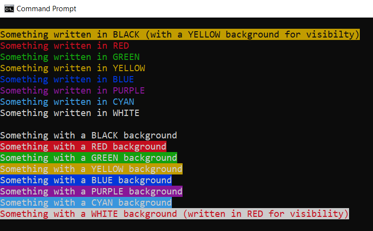

<!-- This file has been generated by the concat-md.ps1 script. -->
<!-- Don't modify this file manually (you'll loose your changes) -->
<!-- but run the tool once more -->

<!-- Last refresh date: 2020-06-05 12:11:47 -->

<!-- below, content of ./index.md -->

# DOS Batch tips

<!-- markdownlint-disable MD046 -->


> A few DOS tips when writing batch files

<!-- table-of-contents - start -->
* [Using ANSI Colors in echo](#using-ansi-colors-in-echo)
* [Variables](#variables)
  * [Get the function name](#get-the-function-name)
  * [Remove double-quotes](#remove-double-quotes)
* [Code snippets](#code-snippets)
  * [Get the number of arguments](#get-the-number-of-arguments)
  * [Ask for user input](#ask-for-user-input)
  * [Get the list of files, process one by one](#get-the-list-of-files-process-one-by-one)
  * [Loop](#loop)
  * [Read a file line by line](#read-a-file-line-by-line)
  * [Get the suffix](#get-the-suffix)
  * [Retrieve the full path of a program in your path](#retrieve-the-full-path-of-a-program-in-your-path)
* [Functions](#functions)
  * [A few theory](#a-few-theory)
    * [Return a boolean or an integer](#return-a-boolean-or-an-integer)
    * [Access the variables inside the function](#access-the-variables-inside-the-function)
  * [CreateLink](#createlink)
  * [File compare](#file-compare)
  * [getAbsolutePath](#getabsolutepath)
  * [getBaseNameWithoutExtension](#getbasenamewithoutextension)
  * [getBaseNameWithExtension](#getbasenamewithextension)
  * [getFileNameFromPATH](#getfilenamefrompath)
  * [getFileSize](#getfilesize)
  * [getFileExtension](#getfileextension)
  * [getFolderName](#getfoldername)
  * [getParentFolderName](#getparentfoldername)
  * [getSymLinkTargetPath](#getsymlinktargetpath)
  * [isAdmin](#isadmin)
  * [isEmptyFolder](#isemptyfolder)
* [License](#license)
<!-- table-of-contents - end -->

<!-- below, content of ./010-ansi-colors/readme.md -->

## Using ANSI Colors in echo



You can combine colors like `[30m[43m` where `30`is the font-color (black) and `43` the background-color (yellow).

```batch
@ECHO off
cls
ECHO.
ECHO [30m[43mSomething written in BLACK (with a YELLOW background for visibility)[0m
ECHO [31mSomething written in RED[0m
ECHO [32mSomething written in GREEN[0m
ECHO [33mSomething written in YELLOW[0m
ECHO [34mSomething written in BLUE[0m
ECHO [35mSomething written in PURPLE[0m
ECHO [36mSomething written in CYAN[0m
ECHO [37mSomething written in WHITE[0m
ECHO.
ECHO [40mSomething with a BLACK background[0m
ECHO [41mSomething with a RED background[0m
ECHO [42mSomething with a GREEN background[0m
ECHO [43mSomething with a YELLOW background[0m
ECHO [44mSomething with a BLUE background[0m
ECHO [45mSomething with a PURPLE background[0m
ECHO [46mSomething with a CYAN background[0m
ECHO [47m[31mSomething with a WHITE background (written in RED for visibility)[0m
```

See also [https://gist.github.com/mlocati/fdabcaeb8071d5c75a2d51712db24011](https://gist.github.com/mlocati/fdabcaeb8071d5c75a2d51712db24011) for a few more like bold, underline, ...

<!-- below, content of ./020-variables/readme.md -->

## Variables

<!-- Table below comes from C:\Christophe\Repository\dos_batch_tips\020-variables\files\variables.csv -->
| Variable | Description |
| --- | ---  |
| `%~0` | In a function, display the name of the function |  [see example below](#get-the-function-name) |
| `%~dfp0` | Return the full name of the running script (return f.i. `c:\temp\a.cmd`) |
| `%~n0%~x0` | Return the base name of the running script (return f.i. `a.cmd`) |
| `%~dp0` | Return the parent folder name of the running script (return `c:\temp\` when the executed script is `c:\temp\a.cmd`). This is different to the current directory. |
| `%cd%` | Return the current directory |
| `%CMDCMDLINE%` | Allow to determine if the script has been fired from a DOS prompt (`"C:\WINDOWS\system32\cmd.exe"`) or with a double-click from f.i. the file explorer (`C:\WINDOWS\system32\cmd.exe /c ""C:\temp\script.bat" "`) |
| `%DATE%` | The system date |
| `%ERRORLEVEL%` | The error level returned by the last executed command, or by the last called batch script |
| `%RANDOM%` | A generated pseudo-random number between 0 and 32767 |
| `%TIME%` | The system time in HH:MM:SS.mm format |

### Get the function name

This is useful for, f.i., debugging purpose (saying which function is responsible for which action/ECHO);

```bash
@echo off
cls

call :showhelp :show
exit/b

:showhelp
    ECHO You are in function %~0
    GOTO:EOF
```

### Remove double-quotes

Suppose your script is started with a parameter like this: `run.cmd "C:\Program Files\Windows Photo Viewer\readme.txt"`.

The parameter needs double-quotes here since the full name contains spaces.

The solution is to use `%THE_VARIABLE:"=%` i.e. the name of the variable followed by a `:`, the character to trim `"` and ended by `=`.

```batch
@ECHO off
cls

SET INPUT="C:\Program Files\Windows Photo Viewer\readme.txt"

ECHO Not filtered: %INPUT%

SET FILTERED=%INPUT:"=%

ECHO Filtered    : %FILTERED%
```

<!-- below, content of ./030-code-snippets/readme.md -->

## Code snippets

<!-- below, content of ./030-code-snippets/arguments_count/readme.md -->

### Get the number of arguments

Count the number of arguments passed to the script.

*This code can't be put in a function since, then, we need to pass arguments to the function and we don't know how many arguments are there.*

```batch
set argcount=0
for %%i in (%*) do set /a argcount+=1
ECHO The number of arguments is %argcount%

```

<!-- below, content of ./030-code-snippets/ask_user_input/readme.md -->

### Ask for user input

`choice` allow to prompt user input. When the choice is a list of options (yes/no or like below 1/2/3/0), the selected option index can be retrieved by reading the `%ERRORLEVEL%` variable.

```batch
@ECHO OFF

CHOICE /C 1230 /M "Press 1 ... or 2 ... or 3  ... or 0 to quit"

IF "%ERRORLEVEL%"=="1" SET ANSWER=You've choosen for 1
IF "%ERRORLEVEL%"=="2" SET ANSWER=You've choosen for 2
IF "%ERRORLEVEL%"=="3" SET ANSWER=You've choosen for 3
IF "%ERRORLEVEL%"=="4" SET ANSWER=You've choosen to cancel

ECHO Your choice: %ANSWER%
```

<!-- below, content of ./030-code-snippets/get_list_of_files/readme.md -->

### Get the list of files, process one by one

Get the list of files in the current folder (in the example) and process files one by one.

```batch
@ECHO off
cls
for %%f in (*.*) do (
    ECHO %%f
)
```

<!-- below, content of ./030-code-snippets/loops/readme.md -->

### Loop

> See [https://en.wikibooks.org/wiki/Windows_Batch_Scripting#FOR](https://en.wikibooks.org/wiki/Windows_Batch_Scripting#FOR) for much more way to make a loop

Simple loop, from 1 till 5

```batch
@ECHO off
cls
for %%i in (1,2,3,4,5) do (
    ECHO %%i
)
```

Loop from 1 till 20, only odd numbers

```batch
@ECHO off
cls
for /l %%i in (1,2,20) do (
    ECHO %%i
)
```

<!-- below, content of ./030-code-snippets/read-file-line-by-line/readme.md -->

### Read a file line by line

With the `for /f` construct like below, we can process a file line by line, like below:

```batch
@ECHO off
cls
for /f "tokens=*" %%l in (readme.md) do (
    ECHO %%l
)
```

<!-- below, content of ./030-code-snippets/right/readme.md -->

### Get the suffix

How to extract the xxx last characters of a string.

```bash
@echo off

SET folder=C:\Folder\SubFolder.wiki
SET SUFFIX=%folder:~-5%

IF %SUFFIX% EQU ".wiki" (
    ECHO "The foldername ends with .wiki"
)
```

<!-- below, content of ./030-code-snippets/which/readme.md -->

### Retrieve the full path of a program in your path

Let's take a real life example: your batch will run an external program and redirect the output to a text file so, just before leaving the batch, you can open the file with [Notepad++](https://notepad-plus-plus.org/) but ... how can you make your code generic and open notepad.exe if notepad++ isn't installed?

Here is the solution:

First make sure that the folder where Notepad++ is well mentioned in your system environment variables (i.e. in `PATH`).
Then check the code below; mainly the `IF EXISTS` block. The `FOR /F ...` line is quite strange but allow to run the `where notepad++.exe` command and redirect the output into the `notepad` variable.

* If notepad++ is found in the `PATH`, `%%g` will be initialized to the full path of the program;
* If notepad++ is not found, the code won't reset the notepad variable and thus keep the default `notepad.exe` value.

```batch
@ECHO OFF

SETLOCAL EnableDelayedExpansion

SET outputFile=%tmp%\test.log

REM Any statements... the objective here is just to create a log file
DIR *.* > %outputFile%

REM Open the log
IF EXIST %outputFile% (

    SET notepad=notepad.exe

    WHERE "notepad++.exe" /Q

    IF !errorlevel!==0 (
        FOR /F "tokens=*" %%g IN ("where notepad++.exe") do (
            SET notepad=%%g
        )
    )

    REM Start notepad++.exe is present otherwise start notepad.exe
    START "!notepad!" %outputFile%
)

ENDLOCAL
```

<!-- below, content of ./040-functions/readme.md -->

## Functions

<!-- below, content of ./040-functions/000_theory/readme.md -->

### A few theory

#### Return a boolean or an integer

For this purpose, just use the `%errorlevel%` internal value.

Below an example, idea is to validate a list of mandatory parameters. If the check is successful, return 0, if anything goes wrong, return -1 (or any code in fact).

```batch
REM Check parameters and make sure mandatory parameters have been set
call :checkParams %1 %2 %3

if  %errorlevel% == 0 (
    ECHO "Great, parameters have been set"
)

::--------------------------------------------------------
::-- checkParams - Make sure this script is called with the
::      required parameters. In case of errors, the help is
::      displayed and the script will be ended
::  return 0 when success, -1 otherwise
::--------------------------------------------------------
:checkParams

    SET bContinue=0

    IF "%1"=="" (
        ECHO "Please specify a value for all required parameters."
        SET bContinue=-1
    ) ELSE (
        IF "%2"=="" (
            ECHO "You have mention only the first parameter. Please also do this for the second and third one."
            SET bContinue=-1
        ) ELSE (
            IF "%3"=="" (
                ECHO "You forget to set the third parameter."
                SET bContinue=-1
            )
        )
    )

    exit /b %bContinue%
```

#### Access the variables inside the function

A function parameter is retrieved by using the `%~` syntax; followed by a number to get the first parameter, the second one, ...

For instance (partial example; not executable as is)

```batch
@ECHO off
REM Call doIit with two parameters, we can imagine that the first
REM parameter can be any extension and the second is an action
REM like open/copy/print/...
CALL :doIt "PDF" "OPEN"
EXIT/B

:doIt
    ECHO Generate %~1 files and, when done, %~2 them
    GOTO:EOF
```

<!-- below, content of ./040-functions/create_symbolic_link/readme.md -->

### CreateLink

Create a symbolic link only if the file doesn't exists yet or is different.

The example below will use the file `c:\master\git_check_status.cmd` as the master one.

If the file `git_check_status.cmd` didn't exists yet in the current folder or if the content of that file is different, the file will be (re) created: a symbolic link will be made to the master one.

@ECHO off
cls

call :fnFileCreateLink "git_check_status.cmd" "c:\master\git_check_status.cmd"

GOTO END:

::--------------------------------------------------------
::-- fnFileCompare: Compare two files
::      %1 = Full name of the first file
::           f.i. "C:\Christophe\Repository\push_wiki.cmd"
::      %2 = Full name of the second file
::           f.i. "C:\Christophe\Repository\master\push_wiki.cmd"
::
:: Return "0" when files are identical; "1" otherwise
::--------------------------------------------------------
:fnFileCompare

    SET current=%1
    SET master=%2

    SET FileCompare="0"

    REM /C - case insensitive
    REM /L - compare as ASCII text
    REM /W - compress whitespace and tabs for comparison
    fc /C /L /W "%current%" "%master%" > nul

    REM 0 = files are identical
    REM 1 = files are different
    REM 2 = at least one file didn't exists
    IF %ERRORLEVEL% NEQ 0 SET FileCompare="1"

    GOTO:EOF

::--------------------------------------------------------
::-- fnFileCreateLink: Create a file that is a symbolic
::      link to another one
::
::      %1 = Full name of the file to create
::           f.i. "C:\Christophe\Repository\push_wiki.cmd"
::      %2 = Full name of the master file
::           f.i. "C:\Christophe\Repository\master\push_wiki.cmd"
::
:: Note: if the file is already present, a file compare will be
::      made so the file will be "recreated" only if there is
::      a difference with the master one.
::--------------------------------------------------------
:fnFileCreateLink

    SET current=%1
    SET master=%2

    SET CreateFile="Y"

    IF EXIST "%current%" (

        REM The file already exists, check if different of the master
        call :fnFileCompare "%current%" "%master%"

        IF !FileCompare! EQU "0" (
            REM Files are identical, nothing to dy
            SET CreateFile="N"
        )
    )

    IF %CreateFile% EQU "Y" (
        IF EXIST "%current%" DEL "%current%"
        MKLINK "%current%" "%master%"
    )

    GOTO:EOF

:END

<!-- below, content of ./040-functions/file_compare/readme.md -->

### File compare

Compare two files, return `0` when files are identical, `1` when there is at least one difference.

<!-- below, content of ./040-functions/get_absolute_path/readme.md -->

### getAbsolutePath

Get the absolute path from a relative file.

```batch
@ECHO off
cls

CALL :getAbsolutePath %~dp0..\..\..\..\..\..\autoexec.bat

REM Display C:\autoexec.bat
ECHO %AbsolutePath%

GOTO END:

::--------------------------------------------------------
::-- getAbsolutePath - Make a path absolute, like reapath() does
::--    %1 A filename
::--
::-- Return "C:\Temp\test.cmd" when %1 is "C:\Folder\..\Temp\test.cmd"
::--------------------------------------------------------
:getAbsolutePath
    SET AbsolutePath=%~dpfn1
    GOTO:EOF

:END
```

<!-- below, content of ./040-functions/get_basename_without_extension/readme.md -->

### getBaseNameWithoutExtension

Remove any folder in a variable filename and return only the filename but without the extension.

```batch
@ECHO off
cls

CALL :getBaseNameWithoutExtension C:\Folder\SubFolder\test.txt

REM Display test
ECHO Basename without extension is "%BaseNameWithoutExtension%"

GOTO END:

::--------------------------------------------------------
::-- getBaseNameWithoutExtension - Get basename of a file w/ extension
::--    %1 A filename
::--
::-- Return "test" when %1 is "C:\Folder\SubFolder\test.txt"
::--------------------------------------------------------
:getBaseNameWithoutExtension
    SET BaseNameWithoutExtension=%~n1
    GOTO:EOF

:END
```

<!-- below, content of ./040-functions/get_basename_with_extension/readme.md -->

### getBaseNameWithExtension

Remove any folder in a variable filename and return only the filename (with extension).

```bash
@ECHO off
cls

CALL :getBaseNameWithExtension C:\Folder\SubFolder\test.txt

REM Display test.txt
ECHO Basename with extension is "%BaseNameWithExtension%"

GOTO END:

::--------------------------------------------------------
::-- getBaseNameWithExtension - Get basename + ext of a file
::--    %1 A filename
::--
::-- Return "test.txt" when %1 is "C:\Folder\SubFolder\test.txt"
::--------------------------------------------------------
:getBaseNameWithExtension
    SET BaseNameWithExtension=%~nx1
    GOTO:EOF

:END
```

<!-- below, content of ./040-functions/get_filename_from_path/readme.md -->

### getFileNameFromPATH

Get the full name of a file that is stored in one of the folder mentioned in the `%PATH%`.

If the file can't be found in the `%PATH%`, return an empty string.

```batch
@ECHO off
cls

CALL :getFileNameFromPATH notepad++.exe

REM If Notepad++.exe is in the PATH, return the full name
REM of the file f.i. C:\Program Files\Notepad++\notepad++.exe
ECHO File name is %FileNameFromPATH%

GOTO END:

::--------------------------------------------------------
::-- getFileNameFromPATH - Get the full name of a file
::--    that is present in the PATH. Return the first occurrence
::--    If the file isn't found, returns an empty string
::--
::--    %1 A filename
::--
::-- Return a number, the size in bytes
::--------------------------------------------------------
:getFileNameFromPATH
    SET FileNameFromPATH=%~$PATH:1
    GOTO:EOF

:END
```

<!-- below, content of ./040-functions/get_filesize/readme.md -->

### getFileSize

Get the file size in bytes.

```batch
@ECHO off
cls

CALL :getFileSize C:\Temp\test.bat

REM Display the filesize
ECHO File size is %FileSize%

GOTO END:

::--------------------------------------------------------
::-- getFileSize - Get the file size in bytes
::--    %1 A filename
::--
::-- Return a number, the size in bytes
::--------------------------------------------------------
:getFileSize
    SET FileSize=%~z1
    GOTO:EOF

:END
```

<!-- below, content of ./040-functions/get_file_extension/readme.md -->

### getFileExtension

Return the file's extension.

Note: when the file has multiple extensions like `.xlsx.bak`, only the last extension is returned.

```batch
@ECHO off
cls

CALL :getFileExtension C:\file.xlsx

REM Display xlsx
ECHO File extension is "%FileExtension%"

GOTO END:

::--------------------------------------------------------
::-- getFileExtension - Get the file's extension
::--    %1 A filename
::--
::-- Return "xlsx" when %1 is "C:\file.xlsx"
::--------------------------------------------------------
:getFileExtension
    SET FileExtension=%~x1
    GOTO:EOF

:END
```

<!-- below, content of ./040-functions/get_foldername/readme.md -->

### getFolderName

Return the folder of a file / sub-folder

```batch
@ECHO off
cls

CALL :getFolderName C:\Folder\SubFolder\test.txt

REM Display C:\Folder\SubFolder\
ECHO %FolderName%

GOTO END:

::--------------------------------------------------------
::-- getFolderName - Get the foldername of a file
::--    %1 A filename
::--
::-- Return "C:\Folder\SubFolder" when %1 is "C:\Folder\SubFolder\test.txt"
::--------------------------------------------------------
:getFolderName
    SET FolderName=%~dp1
    GOTO:EOF

:END
```

<!-- below, content of ./040-functions/get_parent_foldername/readme.md -->

### getParentFolderName

Return the parent folder of a folder

```batch
@ECHO off
cls

CALL :getParentFolderName C:\Folder\SubFolder\

REM Display C:\Folder\
ECHO %ParentFolderName%

GOTO END:

::--------------------------------------------------------
::-- getParentFolderName - Get the parent foldername of a folder
::--    %1 A foldername
::--
::-- Return "C:\Folder\" when %1 is "C:\Folder\SubFolder\"
::--------------------------------------------------------
:getParentFolderName
    SET Folder=%1
    FOR %%a IN ("%Folder:~0,-1%") DO SET ParentFolderName=%%~dpa
    GOTO:EOF

END:
```

<!-- below, content of ./040-functions/get_symlink_target_path/readme.md -->

### getSymLinkTargetPath

Consider the following situation:

* You've a generic script called `C:\Folder\my_script.cmd`
* You've create a symbolic link `C:\Folder\SubFolder\test.cmd` to that file (called the `target path`).

By running `C:\Folder\SubFolder\test.cmd` and displaying the script fullname (`ECHO %~dfp0`), you'll obtain `C:\Folder\SubFolder\test.cmd` which is the symbolic link.
How can you retrieve the target file? The following function will return that info.

```batch
@ECHO off
cls

REM %~dfp0 is the current script filename and thus C:\Folder\SubFolder\test.cmd
CALL :getSymLinkTargetPath %~dfp0

REM Display C:\Folder\my_script.cmd
ECHO %SymLinkTargetPath%

GOTO END:

::--------------------------------------------------------
::-- getSymLinkTargetPath - When a file is a symlink, return the
::--    target path i.e. the original path of the file
::--
::--    %1 A filename that is a symlink to another file
::--
::-- Return "C:\Christophe\...\generate.cmd" f.i. when %1 is
::-- is a symbolic link to that file, no matter where the file is located
::--------------------------------------------------------
:getSymLinkTargetPath

    SET FILE=%1
    SET TargetPath=""
    SET fileDirInfo=""

    IF EXIST %tmp%\symlinks.tmp (
        DEL %tmp%\symlinks.tmp
    )

    REM When using "DIR filename", we get something like below when
    REM the file is a symlink.
    REM 16-10-19  13:18    <SYMLINK>      phan.bat [C:\Christophe\phan.bat]
    REM
    REM Using the findstr pipe will allow us to check if the file is a
    REM symlink
    REM Output that line in the .tmp file so we can read the file after
    REM and process the string as a DOS string variable
    dir %FILE% | findstr "<SYMLINK>" > %tmp%\symlinks.tmp

    IF EXIST %tmp%\symlinks.tmp (
        SET /p fileDirInfo=<%tmp%\symlinks.tmp

        REM Here, fileDirInfo, contains the following:
        REM 16-10-19  13:18    <SYMLINK>      phan.bat [C:\Christophe\phan.bat]
        REM Extract here the portion between brackets => we'll extract part2
        for /f "useback tokens=1,2,3 delims=[]" %%a in ('!fileDirInfo!') do (
            set "TargetPath=%%b"
        )
    )

    REM Done, we've our original file (C:\Christophe\phan.bat)
    SET SymLinkTargetPath=%TargetPath%

    GOTO:EOF

:END
```

<!-- below, content of ./040-functions/is_admin/readme.md -->

### isAdmin

Detect if the script has been executed from a DOS Prompt fired under admin privileges.

```batch
call :fnIsAdminMode

IF %isAdmin% EQU "0" (
    END "Please start this script with admin privileges"
    GOTO END
)

REM ... Ok, the script can continue

GOTO END

::--------------------------------------------------------
::-- fnIsAdminMode: Detect if the CMD prompt has been started
::      with "Run as admin" or not
:: Return "1" when admin mode set; "0" otherwise
::--------------------------------------------------------
:fnIsAdminMode

    SET isAdmin="0"

    openfiles >nul 2>&1

    REM If not equal to 0, command prompt not run under admin privileges
    IF %ERRORLEVEL% EQU 0 SET isAdmin="1"

    GOTO:EOF

END:
```

<!-- below, content of ./040-functions/is_empty_folder/readme.md -->

### isEmptyFolder

Detect is a folder is empty or not.

```bash
@ECHO off
cls

CALL :fnIsEmptyFolder C:\Folder

IF "%isEmpty%" EQU "1" (
    ECHO "The folder is empty"
) ELSE (
    ECHO "There is at least one file in the folder"
)

GOTO END:

::--------------------------------------------------------
::-- fnIsEmptyFolder: Check if a folder is empty or not
:: Return 1 when empty, 0 if there is at least one file
::--------------------------------------------------------
:fnIsEmptyFolder

    SET isEmpty=1

    for /f "delims=" %%a in ("dir /b %1") do (
        REM At least one file
        SET isEmpty=0
    )

    GOTO:EOF

:END
```

<!-- below, content of ./999-license/readme.md -->

## License

[MIT](./../LICENSE)
