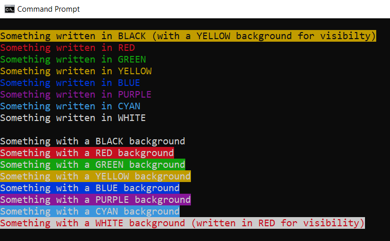

# DOS Batch tips

> A few DOS tips when writing batch files

* [Using ANSI Colors in echo](#using-ansi-colors-in-echo)
* [Variables](#variables)
  * [Get the function name](#get-the-function-name)
  * [Remove double-quotes](#remove-double-quotes)
* [Snippets](#snippets)
  * [Retrieve the full path of a program in your path](#retrieve-the-full-path-of-a-program-in-your-path)
* [Functions](#functions)
  * [A few theory](#a-few-theory)
    * [Return a boolean or an integer](#return-a-boolean-or-an-integer)
    * [Access the variables inside the function](#access-the-variables-inside-the-function)
  * [Some piece of code](#some-piece-of-code)
    * [Ask for user input](#ask-for-user-input)
    * [Get the number of arguments](#get-the-number-of-arguments)
    * [Loop](#loop)
    * [Get the list of files, process one by one](#get-the-list-of-files-process-one-by-one)
    * [Read a file line by line](#read-a-file-line-by-line)
  * [Some functions](#some-functions)
    * [getAbsolutePath](#getabsolutepath)
    * [getBaseNameWithExtension](#getbasenamewithextension)
    * [getBaseNameWithoutExtension](#getbasenamewithoutextension)
    * [getFileExtension](#getfileextension)
    * [getFileNameFromPATH](#getfilenamefrompath)
    * [getFileSize](#getfilesize)
    * [getFolderName](#getfoldername)
* [License](#license)

## Using ANSI Colors in echo



You can combine colors like `` where `30`is the font-color (black) and `43` the background-color (yellow).

```txt
@echo off
cls
echo.
echo Something written in BLACK (with a YELLOW background for visibilty)
echo Something written in RED
echo Something written in GREEN
echo Something written in YELLOW
echo Something written in BLUE
echo Something written in PURPLE
echo Something written in CYAN
echo Something written in WHITE
echo.
echo Something with a BLACK background
echo Something with a RED background
echo Something with a GREEN background
echo Something with a YELLOW background
echo Something with a BLUE background
echo Something with a PURPLE background
echo Something with a CYAN background
echo Something with a WHITE background (written in RED for visibility)
```

See also [https://gist.github.com/mlocati/fdabcaeb8071d5c75a2d51712db24011](https://gist.github.com/mlocati/fdabcaeb8071d5c75a2d51712db24011) for a few more like bold, underline, ...

## Variables

| Variable       | Description                                                                                                                                                                                                       |
| -------------- | ----------------------------------------------------------------------------------------------------------------------------------------------------------------------------------------------------------------- |
| `%~0`          | In a function, display the name of the function; [see example below](#get-the-function-name).                                                                                                                     |
| `%~dfp0`       | Return the full name of the running script (return f.i. `c:\temp\a.cmd`).                                                                                                                                         |
| `%~dp0`        | Return the parent folder name of the running script (return `c:\temp\` when the executed script is `c:\temp\a.cmd`). This is different to the current directory.                                                  |
| `%cd%`         | Return the current directory.                                                                                                                                                                                     |
| `%CMDCMDLINE%` | Allow to determine if the script has been fired from a DOS prompt (`"C:\WINDOWS\system32\cmd.exe"`) or with a double-click from f.i. the file explorer (`C:\WINDOWS\system32\cmd.exe /c ""C:\temp\script.bat" "`) |
| `%DATE%`       | The system date                                                                                                                                                                                                   |
| `%ERRORLEVEL%` | The error level returned by the last executed command, or by the last called batch script.                                                                                                                        |
| `%RANDOM%`     | A generated pseudo-random number between 0 and 32767.                                                                                                                                                             |
| `%TIME%`       | The system time in HH:MM:SS.mm format.                                                                                                                                                                            |

### Get the function name

This is useful for, f.i., debugging purpose (saying which function is responsible for which action/echo);

```bash
call :showhelp :show
exit/b

:showhelp
echo You are in function %~0
goto:eof
```

### Remove double-quotes

Suppose your script is started with a parameter like this: `run.cmd "C:\Program Files\Windows Photo Viewer\readme.txt"`.

The parameter needs double-quotes here since the full name contains spaces.

The solution is to use `%THE_VARIABLE:"=%` i.e. the name of the variable followed by a `:`, the character to trim `"` and ended by `=`.

```bash
@echo off
cls

SET INPUT=%1

REM %INPUT% will contains quote so "C:\Program Files\Windows Photo Viewer\readme.txt"
echo Not filtered: %INPUT%

SET FILTERED=%INPUT:"=%

REM %FILTERED% is without the quote so C:\Program Files\Windows Photo Viewer\readme.txt
echo Filtered    : %FILTERED%
```


## Snippets

### Retrieve the full path of a program in your path

Let's take an example: your batch will run an external program and redirect the output to a text file so, just before leaving the batch, you can open the file with [Notepad++](https://notepad-plus-plus.org/) but ... how can you make your code generic and open notepad.exe if notepad++ isn't installed?

Here is the solution:

First make sure that the folder where Notepad++ is well mentioned in your system environment variables (i.e. in `PATH`).
Then, in your code, add these last three lines. The `FOR /F ...` line is quite strange but allow to run the `where notepad++.exe` command and redirect the output into the `notepad` variable. When 

```batch
SET outputFile = %tmp%\test.log

REM Any statements... the objective here is just to create a log file
dir *.* > %outputFile%

IF EXIST %outputFile% (

    SET notepad=notepad.exe

    WHERE notepad++.exe /Q

    IF %errorlevel%==0 (
        FOR /F "tokens=*" %%g IN ('where notepad++.exe') do (
            SET notepad=%%g
        )
    )

    REM Start notepad++.exe is present otherwise start notepad.exe
    START %notepad% %outputFile%
)
```

## Functions

### A few theory

#### Return a boolean or an integer

For this purpose, just use the `%errorlevel%` internal value.

Below an example, idea is to validate a list of mandatory parameters. If the check is successful, return 0, if anything goes wrong, return -1 (or any code in fact).

```bash
REM Check parameters and make sure mandatory parameters have been set
call :checkParams %1 %2 %3

if  %errorlevel% == 0 (
    echo "Great, parameters have been set"
)

::--------------------------------------------------------
::-- checkParams - Make sure this script is called with the
::      required parameters. In case of errors, the help is
::      displayed and the script will be ended
::  return 0 when success, -1 otherwise
::--------------------------------------------------------
:checkParams

SET bContinue=0

IF "%1"=="" (
    echo "Please specify a value for all required parameters."
    SET bContinue=-1
) ELSE (
    IF "%2"=="" (
        echo "You have mention only the first parameter. Please also do this for the second and third one."
        SET bContinue=-1
    ) ELSE (
        IF "%3"=="" (
            echo "You forget to set the third parameter."
            SET bContinue=-1
        )
    )
)

exit /b %bContinue%
```

#### Access the variables inside the function

A function parameter is retrieved by using the `%~` syntax; followed by a number to get the first parameter, the second one, ...

For instance (partial example; not executable as is)

```bash
@echo off
REM Call doIit with two parameters, we can imagine that the first
REM parameter can be any extension and the second is an action
REM like open/copy/print/...
CALL :doIt "PDF" "OPEN"
EXIT/B

:doIt
ECHO Generate %~1 files and, when done, %~2 them
goto:eof
```

### Some piece of code

#### Ask for user input

`choice` allow to prompt user input. When the choice is a list of options (yes/no or like below 1/2/3/0), the selected option index can be retrieved by reading the `%ERRORLEVEL%` variable.

```bash
@ECHO OFF

CHOICE /C 1230 /M "Appuyez sur 1 pour ... ou 2 pour ... ou sur 3 pour ... ou 0 pour abandonner"

IF "%ERRORLEVEL%"=="1" SET REPONSE=Option 1 choisie
IF "%ERRORLEVEL%"=="2" SET REPONSE=Option 2 choisie
IF "%ERRORLEVEL%"=="3" SET REPONSE=Option 3 choisie
IF "%ERRORLEVEL%"=="4" SET REPONSE=Option 4 Abandon

ECHO Votre choix : %REPONSE%
```

#### Get the number of arguments

Count the number of arguments passed to the script.

*This code can't be put in a function since, then, we need to pass arguments to the function and we don't know how many arguments are there.*

```bash
set argcount=0
for %%i in (%*) do set /a argcount+=1
echo The number of arguments is %argcount%
```


#### Loop

> See [https://en.wikibooks.org/wiki/Windows_Batch_Scripting#FOR](https://en.wikibooks.org/wiki/Windows_Batch_Scripting#FOR) for much more way to make a loop

Simple loop, from 1 till 5

```bash
@echo off
cls
for %%i in (1,2,3,4,5) do (
    echo %%i
)
```

Loop from 1 till 20, only odd numbers

```bash
@echo off
cls
for /l %%i in (1,2,20) do (
    echo %%i
)
```

#### Get the list of files, process one by one

Get the list of files in the current folder (in the example) and process files one by one.

```bash
@echo off
cls
for %%f in (*.*) do (
    echo %%f
)
```

#### Read a file line by line

With the `for /f` construct like below, we can process a file line by line, like below:

```bash
@echo off
cls
for /f "tokens=*" %%l in (readme.md) do (
    echo %%l
)
```

### Some functions

#### getAbsolutePath

Get the absolute path from a relative file.

```bash
@echo off
cls

CALL :getAbsolutePath %~dp0..\..\..\..\..\..\autoexec.bat

REM Display C:\autoexec.bat
echo %AbsolutePath%

GOTO END:

::--------------------------------------------------------
::-- getAbsolutePath - Make a path absolute, like reapath() does
::--    %1 A filename
::--
::-- Return "C:\Temp\test.cmd" when %1 is "C:\Folder\..\Temp\test.cmd"
::--------------------------------------------------------
:getAbsolutePath
SET AbsolutePath=%~dpfn1
goto:eof

:END
```

#### getBaseNameWithExtension

Remove any folder in a variable filename and return only the filename (with extension).

```bash
@echo off
cls

CALL :getBaseNameWithExtension C:\Folder\SubFolder\test.txt

REM Display test.txt
echo Basename with extension is "%BaseNameWithExtension%"

GOTO END:

::--------------------------------------------------------
::-- getBaseNameWithExtension - Get basename + ext of a file
::--    %1 A filename
::--
::-- Return "test.txt" when %1 is "C:\Folder\SubFolder\test.txt"
::--------------------------------------------------------
:getBaseNameWithExtension
SET BaseNameWithExtension=%~nx1
goto:eof

:END
```

#### getBaseNameWithoutExtension

Remove any folder in a variable filename and return only the filename but without the extension.

```bash
@echo off
cls

CALL :getBaseNameWithoutExtension C:\Folder\SubFolder\test.txt

REM Display test
echo Basename without extension is "%BaseNameWithoutExtension%"

GOTO END:

::--------------------------------------------------------
::-- getBaseNameWithoutExtension - Get basename of a file w/ extension
::--    %1 A filename
::--
::-- Return "test" when %1 is "C:\Folder\SubFolder\test.txt"
::--------------------------------------------------------
:getBaseNameWithoutExtension
SET BaseNameWithoutExtension=%~n1
goto:eof

:END
```

#### getFileExtension

Return the file's extension.

Note: when the file has multiple extensions like .xlsx.bak, only the last extension is returned.

```bash
@echo off
cls

CALL :getFileExtension C:\file.xlsx

REM Display xlsx
echo File extension is "%FileExtension%"

GOTO END:

::--------------------------------------------------------
::-- getFileExtension - Get the file's extension
::--    %1 A filename
::--
::-- Return "xlsx" when %1 is "C:\file.xlsx"
::--------------------------------------------------------
:getFileExtension
SET FileExtension=%~x1
goto:eof

:END
```

#### getFileNameFromPATH

Get the full name of a file that is stored in one of the folder mentioned in the `%PATH%`.

If the file can't be found in the `%PATH%`, return an empty string.

```bash
@echo off
cls

CALL :getFileNameFromPATH notepad++.exe

REM If Notepad++.exe is in the PATH, return the full name
REM of the file f.i. C:\Program Files\Notepad++\notepad++.exe
echo File name is %FileNameFromPATH%

GOTO END:

::--------------------------------------------------------
::-- getFileNameFromPATH - Get the full name of a file 
::--    that is present in the PATH. Return the first occurrence
::--    If the file isn't found, returns an empty string
::--
::--    %1 A filename
::--
::-- Return a number, the size in bytes
::--------------------------------------------------------
:getFileNameFromPATH
SET FileNameFromPATH=%~$PATH:1
goto:eof

:END
```

#### getFileSize

Get the file size in bytes.

```bash
@echo off
cls

CALL :getFileSize C:\Temp\test.bat

REM Display the filesize
echo File size is %FileSize%

GOTO END:

::--------------------------------------------------------
::-- getFileSize - Get the file size in bytes
::--    %1 A filename
::--
::-- Return a number, the size in bytes
::--------------------------------------------------------
:getFileSize
SET FileSize=%~z1
goto:eof

:END
```

#### getFolderName

Return the folder of a file / sub-folder

```bash
@echo off
cls

CALL :getFolderName C:\Folder\SubFolder\test.txt

REM Display C:\Folder\SubFolder\
echo %FolderName%

GOTO END:

::--------------------------------------------------------
::-- getFolderName - Get the foldername of a file
::--    %1 A filename
::--
::-- Return "C:\Folder\SubFolder" when %1 is "C:\Folder\SubFolder\test.txt"
::--------------------------------------------------------
:getFolderName
SET FolderName=%~dp1
goto:eof

:END
```

## License

[MIT](LICENSE)
